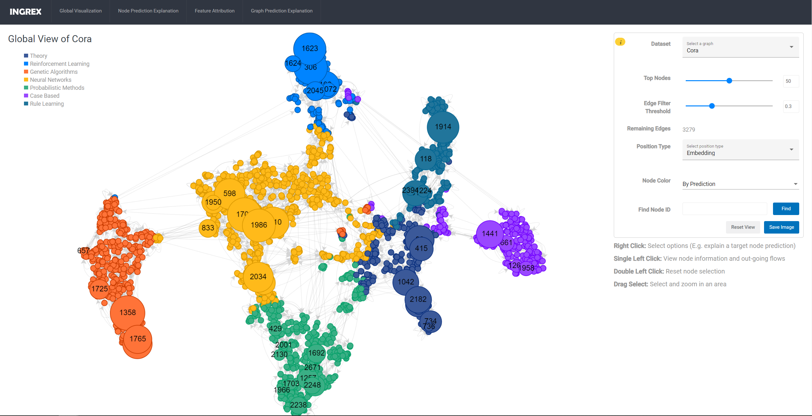
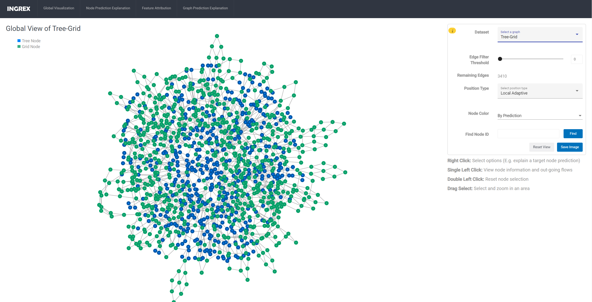
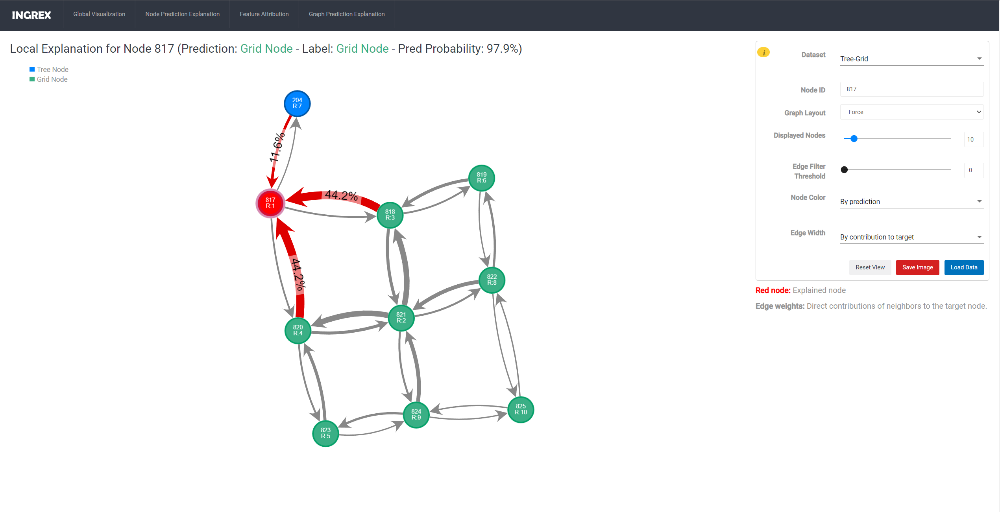
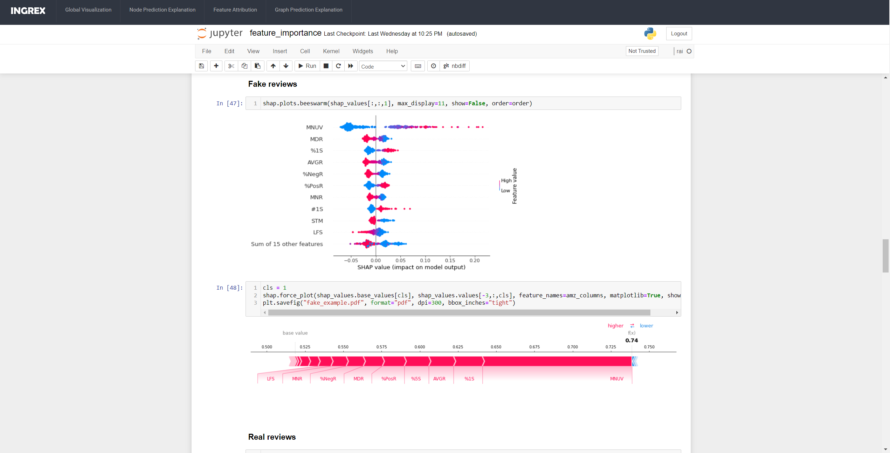
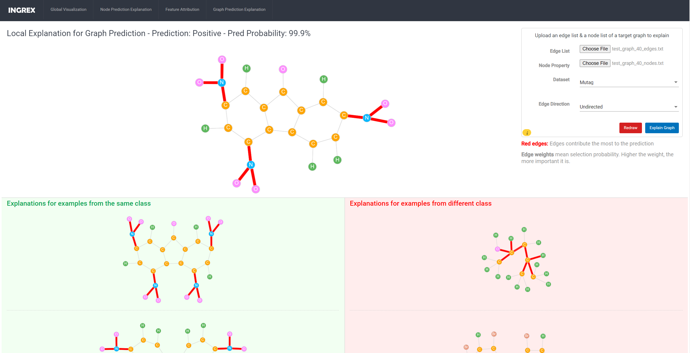
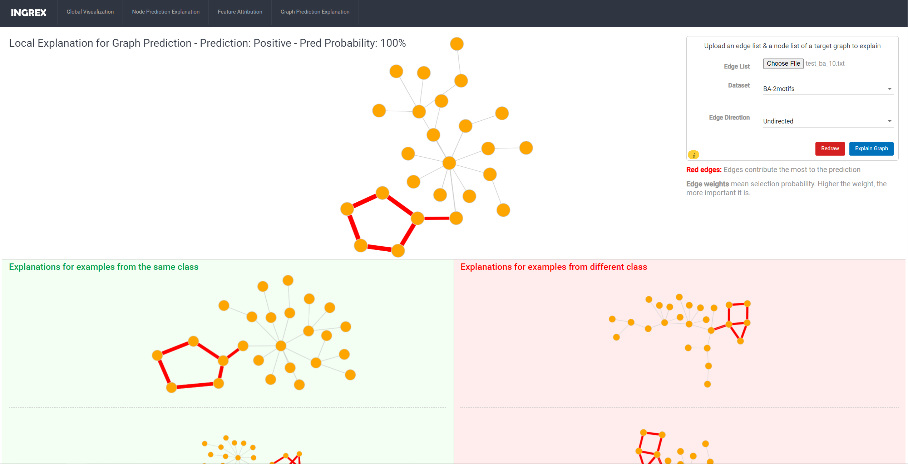

# This is the official source code for INGREX: An Interactive Graph Neural Network Explanation Framework

Explanation methods used in this framework are proposed in [SCALE](https://arxiv.org/abs/2210.11094) - [Source Code](https://github.com/alexbui91/SCALE) and [PGX](https://arxiv.org/abs/2208.03075)

The project includes two components: frontend and backend. The frontend (./sc_viz) is implemented using Angular and CytoscapeJS. The backend (./web_server) uses flask as the webserver. Please checkout the README files of corresponding folders to build the web application and run the web server. Both of them need to be run.

Folder mutag_test_graphs contains some test graphs using for evaluating graph explanations.

## Some screen captures:

***Global Visualization for Cora***

***Global Visualization for Tree-Grid***

***Local Explanation for a Node in Tree-Grid***

***Examining Node Feature Attributions in Amazon Dataset***

***Examining Node Feature Attributions in Amazon Dataset***

***Graph Prediction Explanation for BA-2motifs***
